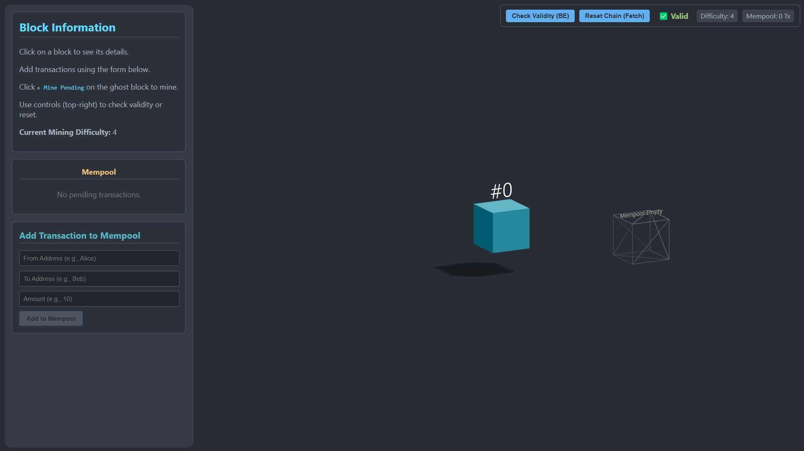
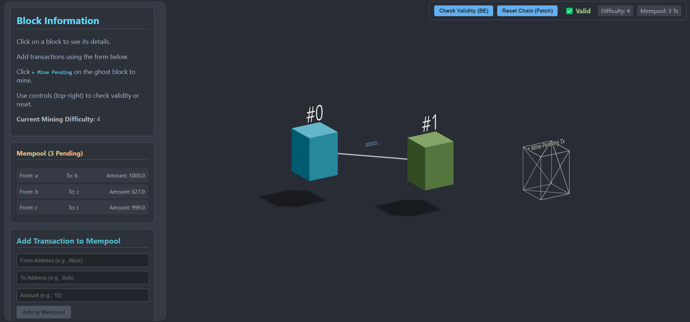
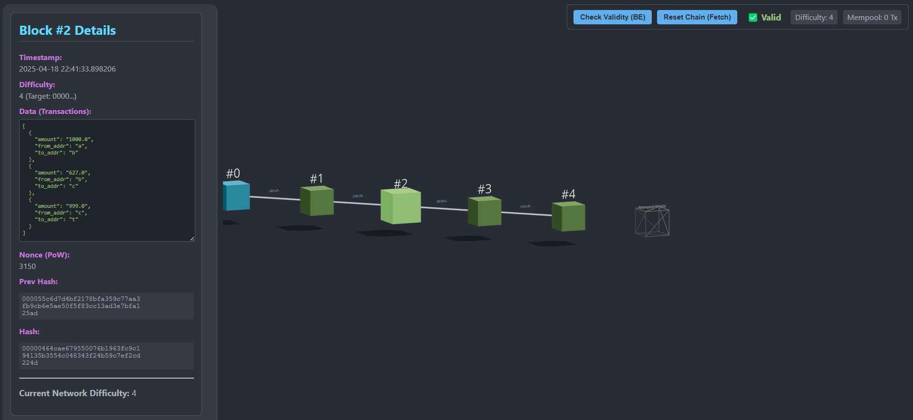
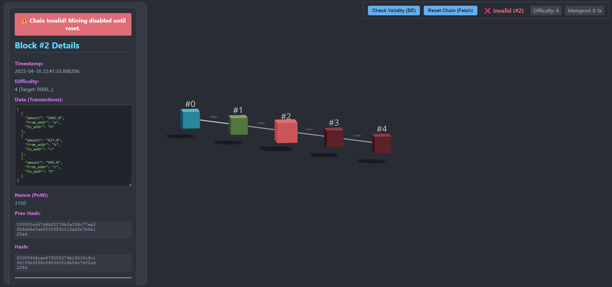
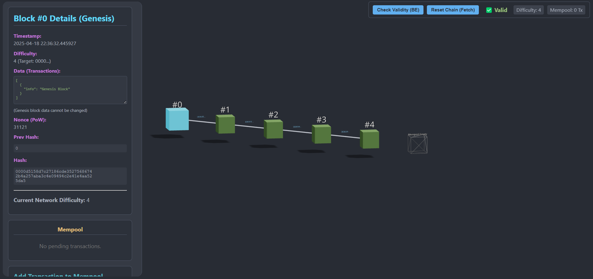
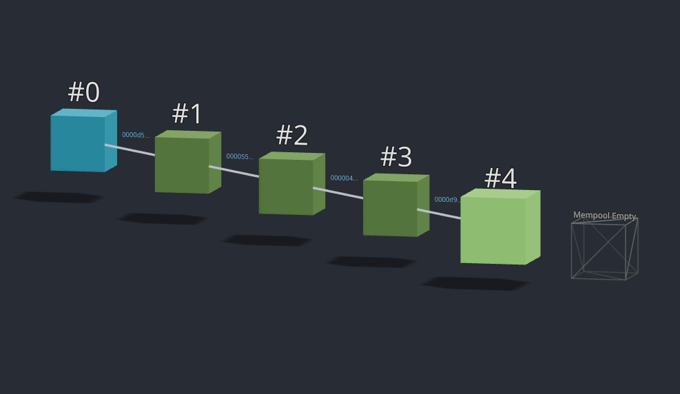

# 3D Blockchain Visualizer

This project is a simple blockchain demo with a 3D visualizer frontend and a Python backend.

## Results








## Structure

- `backend/` — Flask API server for blockchain logic
- `frontend/` — React app for visualization and interaction

## Getting Started

1. **Start the backend:**
   ```
   cd backend
   python app.py
   ```

2. **Start the frontend:**
   ```
   cd frontend
   npm install
   npm run dev
   ```

3. Open [http://localhost:5173](http://localhost:5173) in your browser.

## Features

- Add transactions to the mempool
- Mine blocks with Proof-of-Work
- Visualize blockchain and block validity
- Tamper with block data and check chain validity

---

For more details, see the code in